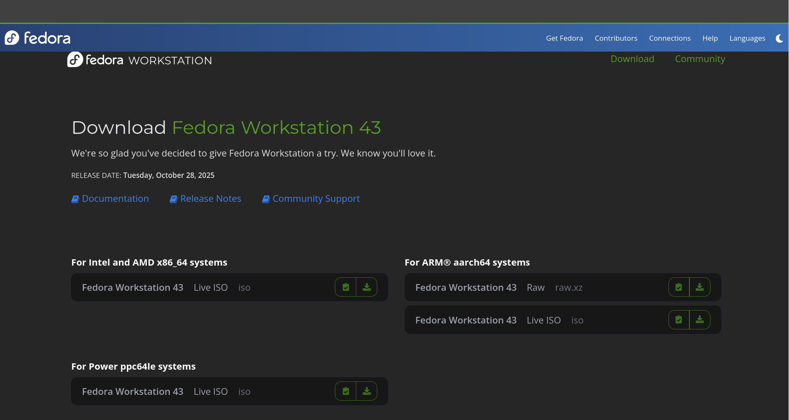
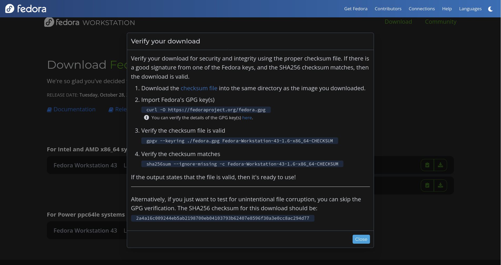

# Download ISO Images

ISO is the file that consists a digital file system as a CD, which stores file required to install and run an operating system.

To install an Operating System from iso you need to create a live boot file from the iso.

Before creating a boot file, let us download different iso(s) from their official website.

## Fedora (My personal Favourite)

- Go to [https://www.fedoraproject.org/workstation/download](https://www.fedoraproject.org/workstation/download), here you will find iso image for latest Fedora Workstation.
- Select your Arch and download the iso image. 
- Download the checksum file and run the following command to verify the iso 
    - Import Fedora's GPG key `curl -o https://fedoraproject.org/fedora.gpg`.
    - Verify the checksum file `gpgv --keyring ./fedora.gpg Fedora-Workstation-43-1.6-x86_64-CHECKSUM`.
    - Verify the iso with checksum `sha256sum --ignore-missing -c Fedora-Workstation-43-1.6-x86_64-CHECKSUM`.

> Why should I verify iso images?
> Because there is chance that the iso is tempered, or incomplete (corrupt). You don't want to use the iso image which can cause system instability.
